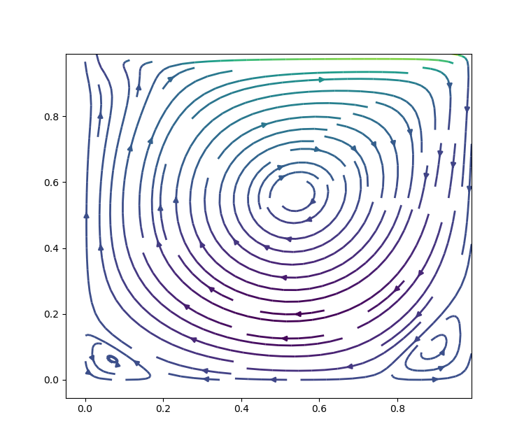
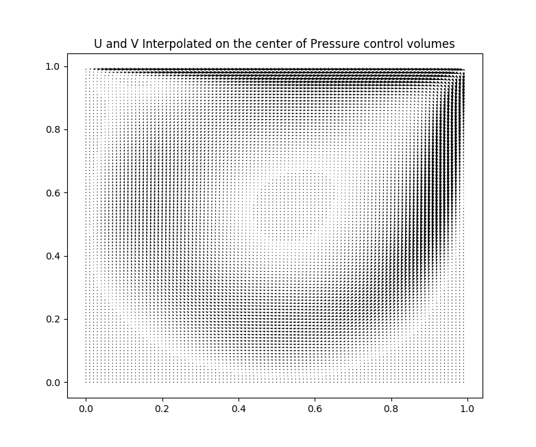
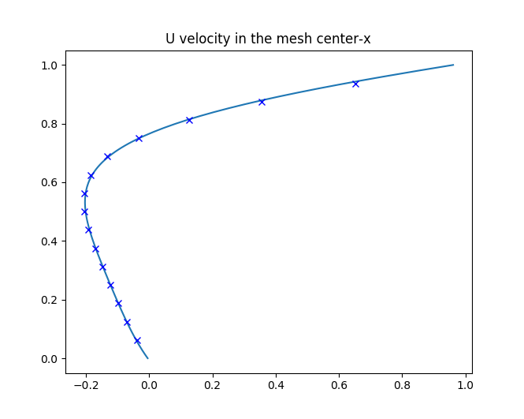
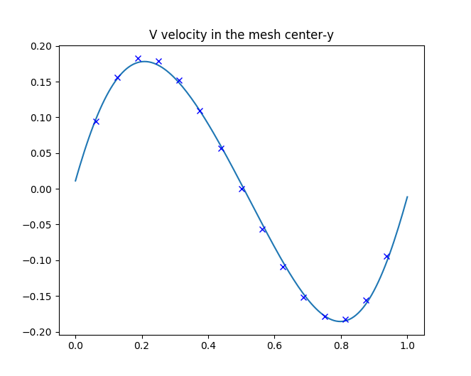

Lid Driven Cavity Problem
=========================

Solver for the Lid Driven Cavity Problem using several frameworks and libraries.
Velocities U and V are solved using the Navier Stokes equations in an staggered grid.
The Conservation of Mass is also solved as an equation for pressure.
Everything is solved together (coupled) using a nonlinear solver.

Example results (100x100 mesh, Re=1000.0):

Comparing results with Ghia, Ghia and Shin (1982):

